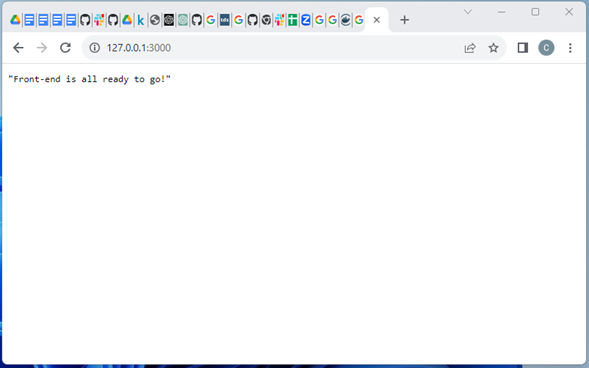

# MLOPs Project - Predicting House Prices (Keras - Artificial Neural Network)

## Introduction of the project

Our MLOps project proposes to address these challenges by merging data science and software engineering in a synergistic collaboration. The objective of the project is to carry out a proof of concept where the implementation of a machine learning model (Artificial Neural Network) will be sought, developing the different stages of MLOps, up to the use of Docker Compose for the deployment of the model.

## About the project

The overall goal of this project is to create a robust and reproducible MLOps workflow for developing, training, and deploying machine learning models. A neural network will be used as proof of concept due, and will be applied to the house price predict data set to predict the price of houses in King County, which includes Seattle.

This project covers the following topics:

1. **Key concepts of ML systems**  
The objective of this module is to give an introduction to MLOps, life cycle and architecture examples is also given.

2. **Basic concepts and tools for software development**  
This module focuses on introducing the principles of software development that will be used in MLOps. Consider the configuration of the environment, tools to use, and best practices, among other things.

3. **Development of ML models**  
This module consists of showing the development of an ML model from experimentation in notebooks, and subsequent code refactoring, to the generation of an API to serve the model.

4. **Deployment of ML models**  
The objective of this module is to show how a model is served as a web service to make predictions.

5. **Integration of concepts**  
This module integrates all the knowledge learned in the previous modules. A demo of Continuous Delivery is implemented.

### Baseline

This MLOps project focuses on demonstrating the implementation of a complete workflow ranging from data preparation to exposing a local web service to making predictions using a neural network. The chosen data set is home sales prices in King County, including Seattle. Includes houses for sale between May 2014 and May 2015.

The purpose is to establish a starting point or "baseline" that will serve as a reference to evaluate future improvements and not only more complex algorithms but more complex components and further deployments.

### Scope

This project is planned to cover the topics seen in the course syllabus, which was designed to include technical capacity levels 0, 1 and a small part of 2 of [Machine Learning operations maturity model - Azure Architecture Center | Microsoft Learn](https://learn.microsoft.com/en-us/azure/architecture/example-scenario/mlops/mlops-maturity-model).

In other words, knowledge is integrated regarding the learning of good software development practices and Dev Ops (Continuous Integration) applied to the deployment of ML models.

### Links to experiments like notebooks

You can find the predict house price experiments here:

* [1-exploring-data.ipynb](docs/notebooks/predicting_house_prices_keras_ann.ipynb)

## Setup

### Python version and packages to install

* Change the directory to the root folder.

* Create a virtual environment with Python 3.10+:

    ```bash
    python3.10 -m venv venv
    ```

* Activate the virtual environment

    ```bash
    source venv/bin/activate
    ```

* Install libraries
Run the following command to install the libraries/packages.

    ```bash
    pip install -r requirements.txt
    ```

## Model training from a house_price_prediction.py file

To train the neural network model, only run the following code:

```bash
python itesm_mlops_project/house_price_prediction.py
```

Output:

```bash
MAE:  105217.97457443322
MSE:  28882225899.6316
RMSE:  169947.7151939137
Variance Regression Score:  0.7944141570971985
Model saved in ./models/neural_network_model.pkl
```

## Execution of unit tests (Pytest)

### Test location

You can find the test location in the [test](tests) folder, and the following tests:

* Test `test_missing_indicator_transform`:  
Test the `transform` method of the MissingIndicator transformer.

* Test `test_missing_indicator_fit`:  
Test the `fit` method of the MissingIndicator transformer.

* Test `test_csv_file_existence`:  
Test case to check if the CSV file exists.

* Test `test_model_existence`:  
Test to validate the existence of a `.pkl` model file.

## Usage
### Individual Fastapi and Use Deployment
FastAPI is a modern web API development framework for Python that combines high performance with a simple declarative syntax. Designed to make it easy to create fast and efficient APIs, FastAPI has quickly gained popularity in the development community due to its speed, ease of use, and automatic generation of interactive documentation.

Uvicorn is a lightning-fast ASGI (Asynchronous Server Gateway Interface) server designed to run Python web applications asynchronously and efficiently. Being an ASGI implementation, Uvicorn takes advantage of the asynchronous nature of Python to handle multiple connections concurrently, enabling exceptionally high throughput and low latency in web applications.

* Run the next command to start the house predict API locally

    ```bash
    uvicorn itesm_mlops_project.api.main:app --reload
    ```

#### Checking endpoints

1. Access `http://127.0.0.1:8000/`, you will see a message like this `"house predict price is all ready to go!"`
2. Access `http://127.0.0.1:8000/docs`, the browser will display something like this:

3. Try running the following predictions with the endpoint by writing the following values:
    * **Prediction 1**  
        Request body

        ```bash
        {
            "bedrooms": 1,
            "bathrooms": 2,
            "sqft_living": 0,
            "sqft_lot": 0,
            "floors": 0,
            "waterfront": 0,
            "view": 0,
            "condition": 0,
            "grade": 0,
            "sqft_above": 0,
            "sqft_basement": 0,
            "yr_built": 0,
            "yr_renovated": 0,
            "lat": 0,
            "long": 0,
            "sqft_living15": 0,
            "sqft_lot15": 0,
            "month": 0,
            "year": 0
        }

        ```

        Response body
        The output will be:

        ```bash
        "Resultado predicción: [90957.64]"
        ```

    * **Prediction 2**  
        Request body

        ```bash
         {
            "bedrooms": 1,
            "bathrooms": 0,
            "sqft_living": 0,
            "sqft_lot": 0,
            "floors": 0,
            "waterfront": 0,
            "view": 0,
            "condition": 0,
            "grade": 0,
            "sqft_above": 0,
            "sqft_basement": 0,
            "yr_built": 0,
            "yr_renovated": 0,
            "lat": 0,
            "long": 0,
            "sqft_living15": 0,
            "sqft_lot15": 0,
            "month": 0,
            "year": 0
        }
        ```

        Response body
        The output will be:

        ```bash
        "Resultado predicción: [73491.516]"
        ```


### Individual deployment of the API with Docker and usage

#### Build the image

* Ensure you are in the `itesm-mlops-project/` directory (root folder).
* Run the following code to build the image:

    ```bash
    docker build -t house-image ./itesm_mlops_project/app/
    ```

* Inspect the image created by running this command:

    ```bash
    docker images
    ```

    Output:

    ```bash
    REPOSITORY    TAG       IMAGE ID       CREATED         SIZE
    house-image   latest    40045c4fb776   4 minutes ago   2.24GB
    ```

#### Run House Predict Price REST API

1. Run the next command to start the `house-image` image in a container.

    ```bash
    docker run -d --name house-container -p 8000:8000 house-image
    ```

2. Check the container running.

    ```bash
    docker ps -a
    ```

    Output:

    ```bash
    CONTAINER ID   IMAGE          COMMAND                  CREATED       STATUS       PORTS                    NAMES
    a5ed9e2af11c   463a87774a45   "uvicorn main:app --…"   4 hours ago   Up 4 hours   0.0.0.0:8000->8000/tcp   house-container
    ```

#### Checking endpoints for app

1. Access `http://127.0.0.1:8000/`, and you will see a message like this `"House predict price is all ready to go!"`
2. A file called `main.log` will be created automatically inside the container. We will inspect it below.
3. Access `http://127.0.0.1:8000/docs`, the browser will display something like this:
    

4. Try running the following predictions with the endpoint by writing the following values:
    * **Prediction 1**  
        Request body

        ```bash
        {
            "bedrooms": 1,
            "bathrooms": 1,
            "sqft_living": 1,
            "sqft_lot": 0,
            "floors": 0,
            "waterfront": 0,
            "view": 0,
            "condition": 0,
            "grade": 0,
            "sqft_above": 0,
            "sqft_basement": 0,
            "yr_built": 0,
            "yr_renovated": 0,
            "lat": 0,
            "long": 0,
            "sqft_living15": 0,
            "sqft_lot15": 0,
            "month": 0,
            "year": 0
        }
        ```

        Response body
        The output will be:

        ```bash
        "Resultado predicción: [0]"
        ```

        

    * **Prediction 2**  
        Request body

        ```bash
         {
            "bedrooms": 2,
            "bathrooms": 2,
            "sqft_living": 2,
            "sqft_lot": 0,
            "floors": 0,
            "waterfront": 0,
            "view": 0,
            "condition": 0,
            "grade": 0,
            "sqft_above": 0,
            "sqft_basement": 0,
            "yr_built": 0,
            "yr_renovated": 0,
            "lat": 0,
            "long": 0,
            "sqft_living15": 0,
            "sqft_lot15": 0,
            "month": 0,
            "year": 0
        }
        ```

        Response body
        The output will be:

        ```bash
        "Resultado predicción: [1]"
        ```

        

#### Opening the logs

1. Run the command

    ```bash
    docker exec -it house-container bash
    ```

    Output:

    ```bash
    root@53d78fb5223f:/# 
    ```

2. Check the existing files:

    ```bash
    ls
    ```

    Output:

    ```bash
    Dockerfile   bin   etc   main.py       ml_models  opt        requirements.txt  sbin  tmp README.md    boot  home  main_api.log  mnt    predictor  root   srv   usr __pycache__  dev   lib   media         models     proc       run     sys   var
    ```

3. Open the file `main.log` and inspect the logs with this command:

    ```bash
    vim main_api.log
    ```

    Output:

    ```log
    2023-08-23 14:00:08,411:main:main:DEBUG:start API
    2023-08-23 14:00:08,411:main:main:INFO:initialize FAST API
    2023-08-23 14:00:17,440:main:main:INFO:house predict is all ready to go!
    2023-08-23 14:00:21,040:main:main:INFO:Input Values: [[1.0, 2.0, 0.0, 0.0, 0.0, 0.0, 0.0, 0.0, 0.0, 0.0, 0.0, 0.0, 0.0, 0.0, 0.0, 0.0, 0.0, 0.0, 0.0]]

    ```

4. Copy the logs to the root folder:

    ```bash
    docker cp house-container:/main.log .
    ```

    Output:

    ```bash
    Successfully copied 1.85kB to .../itesm-mlops-project/.
    ```

#### Delete container and image

* Stop the container:

    ```bash
    docker stop house-container
    ```

* Verify it was deleted

    ```bash
    docker ps -a
    ```

    Output:

    ```bash
    CONTAINER ID   IMAGE     COMMAND   CREATED   STATUS    PORTS     NAMES
    ```

* Delete the image

    ```bash
    docker rmi house-image
    ```

    Output:

    ```bash
    Deleted: sha256:bb48551cf5423bad83617ad54a8194501aebbc8f3ebb767de62862100d4e7fd2
    ```

### Complete deployment of all containers with Docker Compose and usage

#### Create the network

First, create the network AIService by running this command:

```bash
docker network create AIservice
```

#### Run Docker Compose

* Ensure you are in the directory where the docker-compose.yml file is located

* Run the next command to start the App and Frontend APIs

    ```bash
    docker-compose -f itesm_mlops_project/docker-compose.yml up --build
    ```

    You will see something like this:

    (docs/imgs/start_DC.png)

#### Checking endpoints in Frontend

1. Access `http://127.0.0.1:3000/`, and you will see a message like this `"Front-end is all ready to go!"`
2. A file called `frontend.log` will be created automatically inside the container. We will inspect it below.
3. Access `http://127.0.0.1:3000/docs`, the browser will display something like this:
    


#### Opening the logs in Frontend

Open a new terminal, and execute the following commands:

1. Copy the `frontend` logs to the root folder:

    ```bash
    docker cp itesm_mlops_project-frontend-1:/frontend.log .
    ```

    Output:

    ```bash
    Successfully copied 3.12kB to .../itesm-mlops-project/.
    ```

2. You can inspect the logs and see something similar to this:

    ```bash
    INFO: 2023-08-21 23:42:00,057|main|Front-end is all ready to go!
    DEBUG: 2023-08-21 23:45:43,742|main|Prediction: "Resultado predicción: [0]"
    DEBUG: 2023-08-21 23:46:47,038|main|Prediction: "Resultado predicción: [1]"
    ```

#### Opening the logs in App

Open a new terminal, and execute the following commands:

1. Copy the `app` logs to the root folder:

    ```bash
    docker cp itesm_mlops_project-app-1:/main.log .
    ```

    Output:

    ```bash
    Successfully copied 2.56kB to .../itesm-mlops-project/.
    ```

2. You can inspect the logs and see something similar to this:

    ```bash
    2023-08-23 14:00:08,411:main:main:INFO:initialize FAST API
    2023-08-23 14:00:17,440:main:main:INFO:house predict is all ready to go!
    2023-08-23 14:00:21,040:main:main:INFO:Input Values: [[1.0, 2.0, 0.0, 0.0, 0.0, 0.0, 0.0, 0.0, 0.0, 0.0, 0.0, 0.0, 0.0, 0.0, 0.0, 0.0, 0.0, 0.0, 0.0]]
    2023-08-23 14:00:21,223:main:main:INFO:Prediction Result: [[90957.64]]
    ```

### Delete the containers with Docker Compose

1. Stop the containers that have previously been launched with `docker-compose up`.

    ```bash
    docker-compose -f itesm_mlops_project/docker-compose.yml stop 
    ```

    Output:

    ```bash
    [+] Stopping 2/2
    ✔ Container itesm_mlops_project-frontend-1  Stopped                           0.3s 
    ✔ Container itesm_mlops_project-app-1       Stopped                           0.4s 
    ```

2. Delete the containers stopped from the stage.

    ```bash
    docker-compose -f itesm_mlops_project/docker-compose.yml rm
    ```

    Output:

    ```bash
    ? Going to remove itesm_mlops_project-frontend-1, itesm_mlops_project-app-1 Yes
    [+] Removing 2/0
    ✔ Container itesm_mlops_project-app-1       Removed                           0.0s 
    ✔ Container itesm_mlops_project-frontend-1  Removed                           0.0s 
    ```
